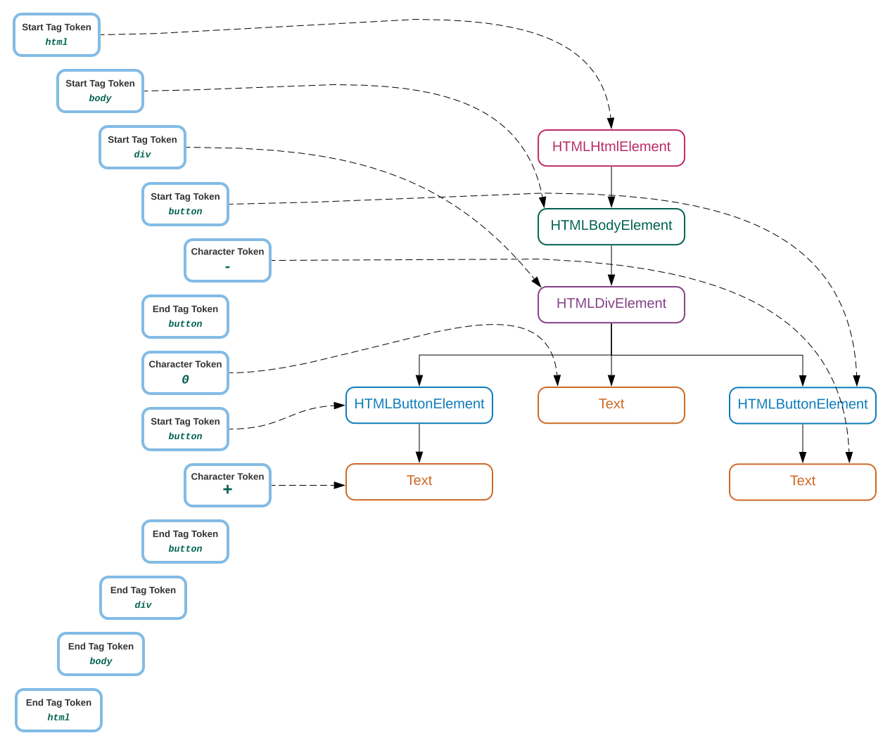

# Fall 2022 Group - Python with Selenium WebDriver

- QA Tools and Automation Testing: Jan 2023 - June 2023

-------------------------------------------

### Zoom details:

- Meeting ID: 843 5249 3141
- Meeting Link: https://us02web.zoom.us/j/84352493141?pwd=ZEc5bmRJbU4yNjByWlNERGw2RGhoQT09
- Passcode: Happy123

------------------------------------------

## Selenium WebDriver sessions agenda:

### Lesson 1 - 5/20/2023

1. Getting started

- how selenium works, why we need that?
- set up Selenium and chromedriver

2. Google search test case - demo

- Developers tool
- Finding Elements (id, name, link)

### Lesson 2 - 5/21/2023, 5/25/2023

3. Using the Selenium Python API for Element Interaction:

- Elements of HTML forms
- find element methods (ID, name, tag, link, xpath, css selector)

### Lesson 3 - 5/27/2023

4. Understanding the WebDriver Class

- properties (current_url, current_window_handle, title, name, window_handles)
- methods (back, close, refresh, get, maximize_window, quit, close, switch_to.window, switch_to.alert)
- Automating browser navigation (back, forward, refresh)

5. Undertading the WebElement class

- properties (text)
- methods (clear, click, get_attribute, is_displayed, is_enabled, is_selected, send_keys, submit)

5.1. Working with forms, textboxes, checkboxes, and radio buttons

- send_keys(), Keys.Enter, click(), is_enabled(), is_displayed()

### Lesson 4 - 5/28/2023

5.2. Working with dropdowns and lists

- Understanding the Select Class (properties, methods)

### Lesson 5 - 06/01/2023

5.3. Working with Alerts/window/iframe

- properties (text)
- methods (accept, dismiss, send_keys)

6. Synchronizing Tests

- Implicit wait and sleep
- Explicit wait (Expected Conditions, WebDriverWait)

### Lesson 6 - - 06/01/2023

7. Advanced Techniques of Selenium WebDriver

- mouse movements (hover over)
- The drag_and_drop method
- Executing JavaScript

### Recorded sessions to be watched

### Lesson 7 - [2022-12-08 - Selenium - mouse actions, screenshots, Python Logging](https://drive.google.com/drive/folders/1fDmME81_pBmvHn9xysbSXtgFPCVafOLy?usp=share_link)

*Above link takes you to the 2022 Fall-SQA Tools Google Drive*

9. Logging in python

- Capturing screenshots of failures

9. Automation Framework Designing Pattern

- What is Page Objects (Usage of Object-Oriented Programming)?
- sample pages and test cases with student registration

### Lesson 8 - [2022-12-10 - Framework - Pytest, test execution](https://drive.google.com/drive/folders/1fTilTNBZDwv9yfis9IlRLNwXnYnk2oCm?usp=share_link)

*Above link takes you to the 2022 Fall-SQA Tools Google Drive*

10. Integration with Other Tools and Frameworks (PyTest)

- running the automation scenarios individually and in a group (marks)
- pytest fixtures, conftest.py shared fixture file setup

### Lesson 9 - [2022-12-11 - Framework - Page Object Modeling, Full Framework, Summary](https://drive.google.com/drive/folders/1fm1hGDvQUyV0jtltggRmKzY1Q5v9Z6RN?usp=share_link)

*Above link takes you to the 2022 Fall-SQA Tools Google Drive*

11. Complete Framework and Jenkins Execution with AWS

### Additional Subjects and Materials

**Please send an access request for
the [Self Study Materials](https://drive.google.com/drive/folders/1oxyinen_o7BWBTrUSNzhhcvsrVXbUpI3?usp=sharing) folder
in the Google Drive.**
In this folder you can find pre-recorded session for API Testing, BDD Introduction, ETL Testing, Mock Interviews and
other Q&As.

**Following are topics are strongly recommended, which will help you on your future job interviews.**

12. [BDD framework and Gherkin scenarios](https://drive.google.com/drive/folders/1dTlgpj4hBUGba-W-eyLr5JRTeBAVlJB-?usp=share_link)
13. [API Testing Foundation and example with Postman](https://drive.google.com/drive/folders/1Xoiomwm7IHePHT06pjPU0K-wntYDdYRD?usp=share_link)
14. [ETL process and testing](https://drive.google.com/drive/folders/12DFzcFpjCU_9NSbkf5cP1fcChvM5rHFs?usp=share_link)
15. [Market prep and Support Sessions (mock interviews and Q&A)](https://drive.google.com/drive/folders/1DXJgX5xNoqRoUs-XBPLkKOvgweMXuPRp?usp=share_link)

-----------------------------------

# Selenium WebDriver with Python

## Selenium setup

1. download selenium
   go to the Terminal (pycharm)

```python
pip
install
selenium  # library, code written by developers, open source
pip
freeze  # to check the selenium is in the list
```

2. download chromedriver
    - check the version of your chrome browser (if you dont have chrome browser, donwload and install it)
    - download the chromedriver from this location: [driver website](https://chromedriver.chromium.org/downloads)
    - select chromedriver_win32.zip if you have windows
    - Extract the downloaded folder and copy the chromedriver file

3. save in the Python main location
    - Go to python main folder: "C:\Program Files\Python39"
    - paste the copied chromedriver file here

4. import selenium, run sample code

```python
from selenium import webdriver
from selenium.webdriver.common.by import By
from selenium.webdriver.common.keys import Keys
from selenium.webdriver.chrome.options import Options
import time

# created the object for chromedriver that talks to Chrome Browser
chr_options = Options()
chr_options.add_experimental_option("detach", True)
driver = webdriver.Chrome(options=chr_options)
print('maximizing the browser window')
driver.maximize_window()

driver.get("https://www.google.com/")
time.sleep(5)

search_box = driver.find_element(By.NAME, "q")
search_box.send_keys("selenium")
search_box.send_keys(Keys.ENTER)
time.sleep(5)

result = driver.find_element(By.ID, 'result-stats')
print(f"Search is done and result text is : {result.text}")

print("closing the browser after test")
driver.quit()
print("Test completed!")
```

----------------------------------

## 1. HTML DOM

## HTML Introduction

HTML is the standard markup language for creating Web pages. Document Object Model - html document (DOM)

## What is HTML?

- HTML stands for Hyper Text Markup Language
- HTML is the standard markup language for creating Web pages
- HTML describes the structure of a Web page
- HTML consists of a series of elements
- HTML elements tell the browser how to display the content
- HTML elements label pieces of content such as "this is a heading", "this is a paragraph", "this is a link", etc.

HTML DOM - html document object model
this is where you find the web page elements and their 'description'.

```html
<!DOCTYPE html>
<html>
<head>
    <title>Page Title</title>
</head>
<body>

<h1>My First Heading</h1>
<p>My first paragraph.</p>

</body>
</html>
```  

* Good read: https://www.w3schools.com/whatis/whatis_html.asp

### Elements of HTML forms



--------

***NOTE: Find out more about http messages and popular status
codes [here](https://www.w3schools.com/tags/ref_httpmessages.asp)***

#### Homework:

Read and try out

- https://www.w3schools.com/html/html_intro.asp
- https://www.w3schools.com/html/html_elements.asp
- https://www.w3schools.com/html/html_attributes.asp
- https://www.w3schools.com/html/html_links.asp
- https://www.w3schools.com/html/html_forms.asp (all other pages for html forms)

### Read about HTTP (API Testing):

Requests to the server (on the Network Inspector or API testing on Postman)

- https://www.w3schools.com/tags/ref_httpmethods.asp

Responds from Server:

- https://www.w3schools.com/tags/ref_httpmessages.asp

### What type of Elements we can see on the web page?

Element types are defined by tags in the HTML document (DOM)

- images

```html

```

- buttons

```html

<button name="submit" id="login" type="button">Login</button>

```  

- links

```html
<a href="https://www.w3schools.com">Visit W3Schools.com!</a>
```  

- text box, checkbox, radio button, password etc.
  The ```<input>``` tag specifies an input field where the user can enter data.

The different input types are as follows:

```html
<input type="button">
<input type="checkbox">
<input type="color">
<input type="date">
<input type="datetime-local">
<input type="email">
<input type="file">
<input type="hidden">
<input type="image">
<input type="month">
<input type="number">
<input type="password">
<input type="radio">
<input type="range">
<input type="reset">
<input type="search">
<input type="submit">
```  

Sample:

```html

<form action="/action_page.php">
    <label for="fname">First name:</label>
    <input type="text" id="fname" name="fname"><br><br>
    <label for="lname">Last name:</label>
    <input type="text" id="lname" name="lname"><br><br>
    <input type="submit" value="Submit">
</form>
```  

- drop down

```html
<select>
    <option>NY</option>
    State</select>

```  

- checkbox
- radio buttons
- videos

Find out about different tags used in the html document [here](https://www.w3schools.com/tags/tag_span.asp)

### Attributes

Each element consist of attributes

```html

<div class="myDiv" id="my-div">
    <h2>This is a heading in a div element</h2>
    <p>This is some text in a div element.</p>
</div>
```

here 'div' is a tag and 'class' is an attribute.
type

### Using chrome developers tools options to inspect web elements

- <h4 style=color:purple>Tags are purple</h4>
- <h4 style=color:red>Attributes are in red</h4>
- <h4 style=color:blue>Values of the attributes will be in blue</h4>
- <h4 style=color:black>text in the elements, that are in the tags, will be in black</h4>

-----------------

## Selenium WebDriver: Finding Elements (locating) on the Web page.

We need to tell Selenium how to find an element so that it can simulate a desired user action, or look at the attributes
or state of an element so that we can perform a check. For example, if we want to search for a product, we need to find
the search text field and search button visually. We enter the search term by pressing various keys on the keyboard and
click on the search button to submit our search request.

We can automate the same actions using Selenium. However, Selenium does not understand these fields or buttons visually
as we do. It needs to find the search textbox and search button to simulate keyboard entry and mouse click
programmatically.

Selenium provides various find_element methods to find elements on a web page. These methods search for an element based
on the criteria supplied to them. If a matching element is found, an instance of WebElement is returned or the
NoSuchElementException exception is thrown if Selenium is not able to find any element matching the search criteria.

### Locator (finding the elements)

Available locators in selenium (find_element(By.locator, 'value')):

- ID
- NAME
- XPATH
- CLASS_NAME
- CSS_SELECTOR
- LINK_TEXT
- PARTIAL_LINK_TEXT

```python
from selenium import webdriver
from selenium.webdriver.common.by import By

driver = webdriver.Chrome()
driver.get("myapp.com")
# all of below methods return single element, 
# return first element if multiple elements found in html document by given locator
driver.find_element(By.ID, 'search')
driver.find_element(By.NAME, 'q')
driver.find_element(By.XPATH, '//form[0]/div[0]/input[0]')
driver.find_element(By.CSS_SELECTOR, '#search')
driver.find_element(By.CLASS_NAME, 'input-text')
driver.find_element(By.TAG_NAME, 'input')
driver.find_element(By.LINK_TEXT, 'Log In')
driver.find_element(By.PARTIAL_LINK_TEXT, 'Log')
```

Selenium also provides various find_elements_by methods to locate multiple elements. These methods search and return a
list of elements that match the supplied values.

```python
from selenium import webdriver
from selenium.webdriver.common.by import By

driver = webdriver.Chrome()
driver.get("myapp.com")
# all of below methods return list of elements , [prod1, prod2, ..]
driver.find_elements(By.ID, 'products')
driver.find_elements(By.NAME, 'products')
driver.find_elements(By.CLASS_NAME, 'input-text')
driver.find_elements(By.TAG_NAME, 'a')
driver.find_elements(By.XPATH, '//div[contains(@class, "lists")]')
driver.find_elements(By.CSS_SELECTOR, '.input-class')
driver.find_elements(By.LINK_TEXT, 'Log In')
driver.find_elements(By.PARTIAL_LINK_TEXT, 'Add to')
```

Demo website: https://www.seleniumeasy.com/test/basic-first-form-demo.html

Example of Locating the element uniquely

### 1. xpath

```python
msg_xpath = '//form/div/input[@id="user-message" and @class="form-control"]'
# Building xpath 
# //tag[@att='value']
# //tag[text()='value']

# option1: 
text_xpath = "//span[@class='mr-3' and @name='text1']"

# Using text of the element to build the xpath: 
# option2: 
text1_xpath = "//span[text()='Click Button to see alert ']"
# option3: 
text1_xpath = "//span[contains(text(), 'Click Button to')]"

# 12/03/2022 HW reading: https://www.guru99.com/xpath-selenium.html
```

This is the xpath for the below element.

```html
<span class="mr-3" name="text1">Click Button to see alert </span>
<input type="text" class="form-control" name="input-message" placeholder="Please enter your Message" id="user-message">
Some text here
</input>
<div class="col">
    <button id="alertButton" type="button" class="btn btn-primary">Click me</button>
</div>
```

### 2. CSS Selector:

Syntax for Locating by CSS Selector Usage

||Method || Target Syntax || Example ||
|Tag and ID | css=tag#id | css=input#email |
|Tag and Class | css=tag.class | css=input.inputtext |
|Tag and Attribute| css=tag[attribute=value] | css=inp ut[name=lastName] |
|Tag, Class, and Attribute| css=tag.class[attribute=value] | css=input.inputtext[tabindex=1] |

[Find out more about CSS Selector here](https://www.guru99.com/locators-in-selenium-ide.html)

** Converting Xpath to CSS selector **
HTML document elements you want to locate:

```html
<span class="mr-3" name="text1">Click Button to see alert </span>
<input type="text" class="form-control" name="input-message" placeholder="Please enter your Message" id="user-message">
Some text here
</input>
<div class="col">
    <button id="alertButton" type="button" class="btn btn-primary">Click me</button>
</div>
```

CSS selectors to build based on above html elements:

```python
"//span[text()='Click Button to see alert ']"
text_css_selector = "span:contains('Click Button to see alert ')"

text_xpath = "//span[@class='mr-3'"
text_css_selector = "span.mr-3"

alert_xpath = "//span[@id='alert1']"
alert_css_selector = "span#alert1"

alert_id = 'alertButton'
alert_xpath = "//button[@id='alertButton' and @type='button']"
alert_css_selector = 'button#alertButton'
alert_css_selector = 'button.btn-primary'
```

**Tags to know:**

```html
links, images, forms (textbox, radio, checkbox, submit, fileupload, <input>, <label>, <select>, <textarea>, <button>)
    div - container to holds the styled elements
CSS - styling document, goes along with html document 
```

**NOTE: read about html click [here](https://www.w3schools.com/w3css/default.asp)**

## 2. WebDriver class

simulates browser action

- properties:    current_url, current_window_handle, window_handles, name,
  title,
- methods:        find_element(), send_keys(), switch_to.window(), back(), 	
  refresh() ....

```python
from selenium import webdriver
from selenium.webdriver.common.by import By

driver = webdriver.Chrome()

driver.back()
driver.forward()
driver.find_element(By.XPATH, 'somexpath')
driver.refresh()
driver.get()
driver.implicitly_wait(10)
driver.maximize_window()
```

---------

### Logging with Python

```python
import logging


def create_logger(file):
    logging.basicConfig(filename=file,
                        level=logging.INFO,
                        format='%(asctime)-15s [%(levelname)s]: %(message)s',
                        filemode='a')
    return logging.getLogger()

```

## 6. Chapter 8. Framework in Test Automation

The way of engineering your project, put your code in structured way:

- Pytest - unit testing framework
    - to generate test reports with pass and fail status.
    - hooks(fixtures)
      this will help you to better manager your execution
    - how to run regression suites

- Page Object Modeling (designing pattern)
    - handle locators and page functions of each page
    - this is good when you work with complex project.
    - helps you to maintain changing web elements
    - Classes, Inheritance, encapsulation, polymorphism


### Reading links:

1. [Getting Started With Pytest and Selenium](https://www.lambdatest.com/blog/selenium-python-pytest-testing-tutorial/)
2. [Full and Complete information about pytest with examples](https://www.guru99.com/pytest-tutorial.html)
2. [Pytest documentation](https://docs.pytest.org/en/7.2.x/)
3. [Optional Reading on Pytest implementation, it is from development point of view](https://realpython.com/pytest-python-testing/)
4. [Behaviour Driven Framework with Pytest-bdd](https://ultimateqa.com/what-is-bdd-and-how-do-we-practice-it/)
5. [Detailed BDD Level Up recording](https://drive.google.com/drive/folders/1oxyinen_o7BWBTrUSNzhhcvsrVXbUpI3?usp=sharing)    
   Please Send request to parent folder in order to have all Self Study Materials.
   [Click here to Send Request for Self Study Materials google driver folder.](https://drive.google.com/drive/folders/1oxyinen_o7BWBTrUSNzhhcvsrVXbUpI3?usp=sharing)
6. [Please watch this recording that shows how to run Automation scripts with Jenkins and AWS](https://drive.google.com/drive/folders/1GEP_Bw_mQVpc2RDdZS3AIUk_UygyzwPA?usp=sharing)

### General Understanding about Test Automation Frameworks

#### 1. Data Driven Framework:

Driver Script per scenario -> Data File -> input/output file
Driver script per scenario >> Data file >> execution >> compare with expected results

#### 2. Keyword Driven Framework:

Driver Script > Keyword(steps consist of function names and inputs) >> data file

#### 3. Behavior Driven Framework (from Test Automation perspective)

**Components of BDD Test Automation Framework

1. src:
   a. Feature file: Gherkin scenarios (plain english using Given, When, Then keywords)
   Given I am in login page.

   b. Steps definition
   @Given("I am in login page.")
   def login():
   # steps to login, code

   c. pages: Page Object Modeling Design Pattern, The way of designing your selenium scripts
    - Object oriented programming concepts (class, object, Inheritance, encapsulation, polymorphism, abstraction)

   d. utilities.py | helper.py | generic_helper.py  >> functions to use to handle data file, reports, general python
   functions

   e. Fixture files (in pytest it is confest.py ), some framework config files


2. Data
    - config.yml
    - stocks_buy.yml

3. Logs
    - 05152022.log

4. Reports
    - 051520221110052_stockbuy_report.html

--------

### PYTEST

running tests :

```python
pytest - s - v
test_scenarios.py
pytest - s - v
test_scenarios.py::test_sample_pytst

# if you have marks for the functions
pytest - s - v - m
sample1

$ pytest - s - v - m
regression - -disable - pytest - warnings >> reports / 20211123_919
_regression

```

Pytest Fixtures

- SetUp : steps to execute before session/file/functions (scope)
- TearDown : steps to execute after session/file/functions (scope)

---------------------------------------------------------		

## Must-know for Automation Testing:

- Web UI Functionality (python, selenium WebDriver, Yes)

- API Automation
    - manual (Yes) : Postman tool, study API testing and webservices
      (Akmal to send a video about this)
    - Automation (maybe, REQUESTS library) (Akmal to send links for quick courses)
      ***NOTE: Find out more about http messages and popular status
      codes [here](https://www.w3schools.com/tags/ref_httpmessages.asp)***


- Backend Automation
  (NO, sql connection with python, server side automation with python)

- Performance testing (NO - jmeter, LoadRunner etc.)
- Security Testing (i.e.Penetration testing, NO)

### Self Study Materials: Chapter 10 Integration with Other Tools and Frameworks

Videos to watch:

- [Bdd Framework Overview](https://drive.google.com/drive/folders/1dTlgpj4hBUGba-W-eyLr5JRTeBAVlJB-?usp=sharing)
- [CI/CD pipelines and working with Jenkins and AWS](https://drive.google.com/drive/folders/1GEP_Bw_mQVpc2RDdZS3AIUk_UygyzwPA?usp=sharing)
- [All Mock interviews to watch](https://drive.google.com/drive/folders/1oxyinen_o7BWBTrUSNzhhcvsrVXbUpI3?usp=sharing)

----- 
**Automation practice websites:**

- https://courses.letskodeit.com/practice
- https://jqueryui.com/droppable/
- https://chercher.tech/practice/explicit-wait-sample-selenium-webdriver

## Useful links and References:

1. [HTTP messages used in API calls](https://www.w3schools.com/tags/ref_httpmessages.asp)
2. [HTML document and tags](https://www.w3schools.com/tags/tag_span.asp)
3. [Learning Selenium Testing Tools with Python (book)](data/Learning_Selenium.pdf)
4. [The Ultimate Selenium Python Cheat Sheet for Test Automation](https://www.lambdatest.com/blog/selenium-python-cheat-sheet/)
5. [What is xpath and how to build them.](https://www.guru99.com/xpath-selenium.html)
6. [Socratica playlist in youtube](https://youtu.be/bY6m6_IIN94)
